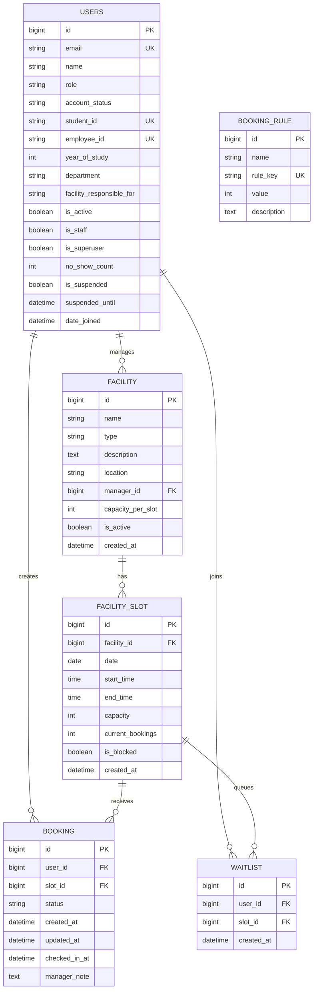
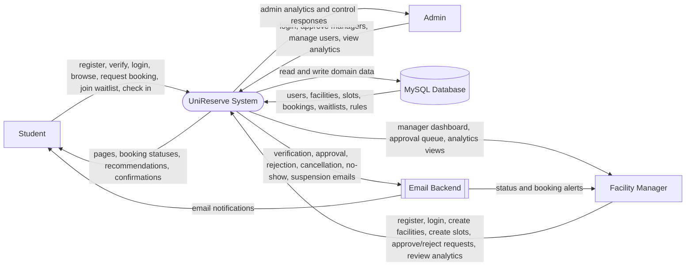
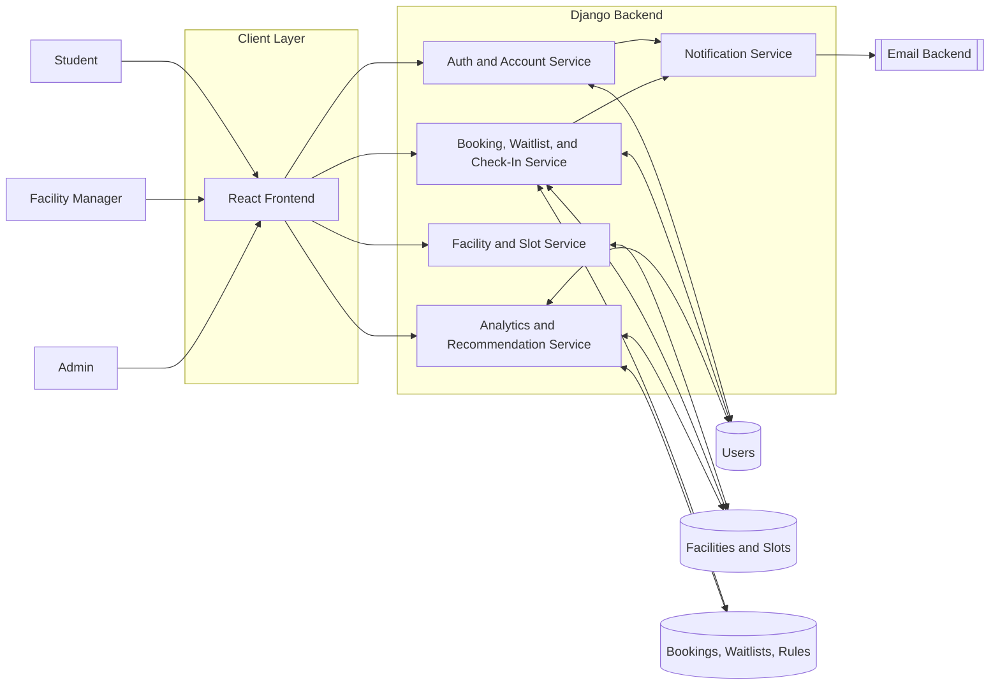
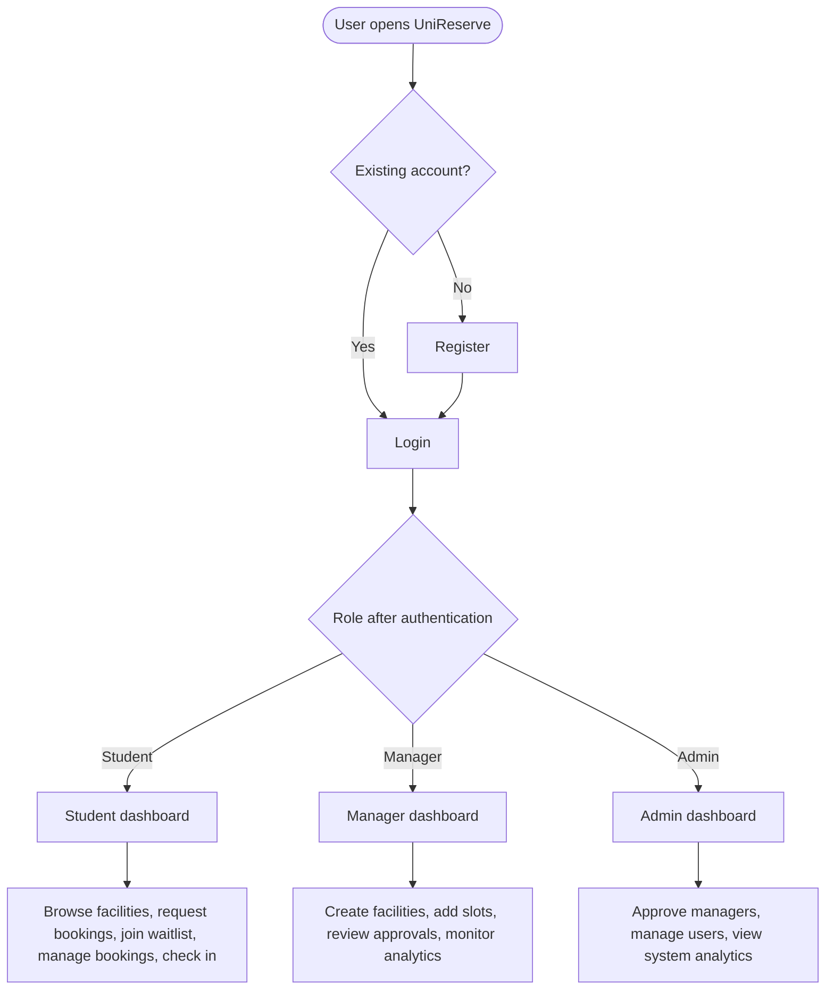
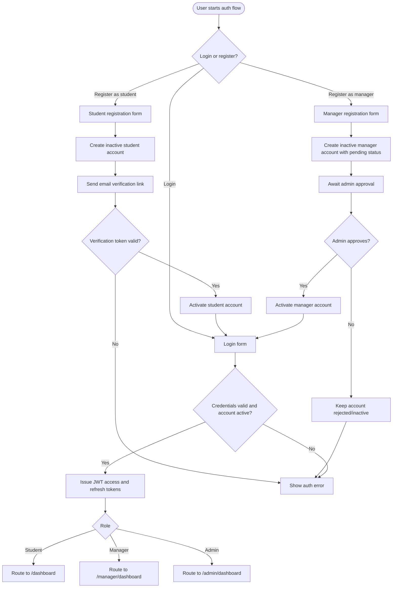
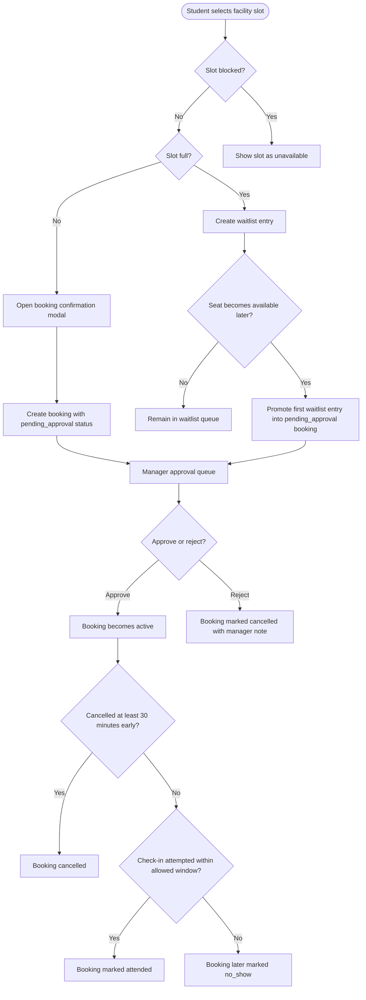
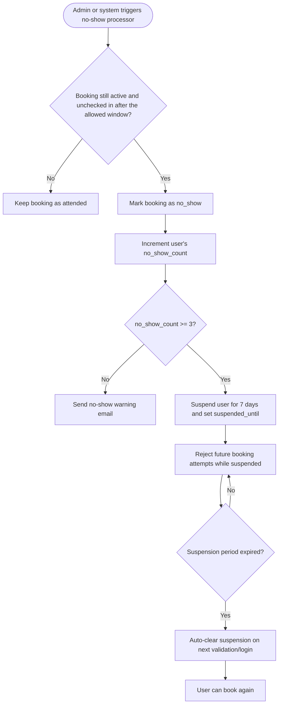
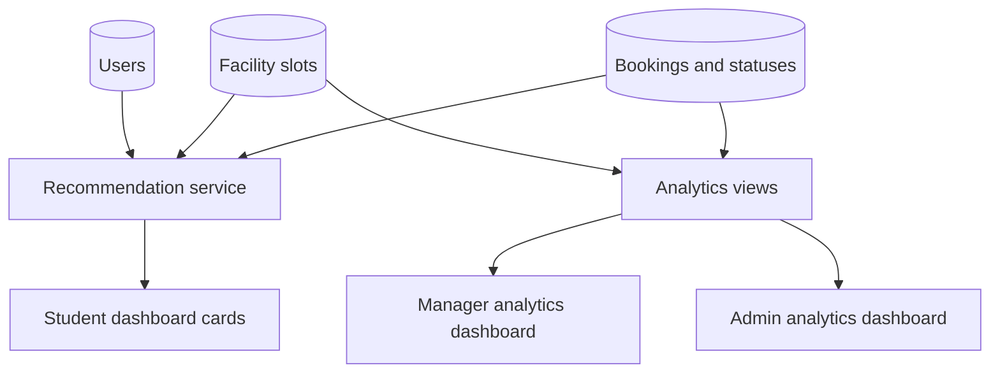

# UniReserve

UniReserve is a full-stack university facility reservation system. It lets students discover campus spaces, request bookings, join waitlists, check in to approved sessions, and track their reservation history. Managers can create facilities and slots, review booking requests, and monitor demand through analytics. Admin users can access system-level analytics and account-management APIs.

This repository contains:

- A React + Vite frontend in `unireserve-frontend`
- A Django REST Framework backend in `unireserve_backend`
- MySQL-backed persistence
- JWT-based authentication
- Email/notification flows for registration, booking changes, and no-show enforcement

This README is based on the current code in the repository, not only the product planning documents.

## Project Summary

### Core idea

UniReserve is designed as a campus booking platform for spaces such as:

- Library seats
- Study rooms
- Computer labs
- Discussion rooms
- Seminar halls
- Music rooms
- 3D printing labs

### User roles

- `student`: browse facilities, request bookings, join waitlists, check in, and manage their own reservations
- `manager`: create and manage facilities/slots they own, approve or reject booking requests, and view analytics for managed spaces
- `admin`: view global analytics and use admin-only account management endpoints

### Current implementation note

In the current backend implementation, every booking request is created with `pending_approval` status and must be approved by a manager before it becomes active. That behavior is broader than the original planning notes and is important for testing the system correctly.

## Implemented Features

### Authentication and account lifecycle

- Student self-registration with email verification
- Manager self-registration with pending approval status
- Login/logout with JWT access and refresh tokens
- Token refresh flow handled by the frontend Axios interceptor
- User profile endpoint for restoring authenticated sessions
- Password reset API endpoints on the backend
- Role-based route protection in the frontend

### Student experience

- Personalized student dashboard
- Facility browsing with search and type filters
- Facility detail and slot-picking flow
- Booking request modal with policy confirmation
- Waitlist join flow for full slots
- Reservation history view with upcoming, waitlist, and past tabs
- Check-in for active bookings during the allowed time window
- Recommendation cards based on recent booking behavior

### Manager experience

- Manager registration flow
- Manager dashboard for:
  - creating facilities
  - creating slots for owned facilities
  - viewing pending approvals
  - approving or rejecting booking requests
- Manager analytics dashboard with booking trends, attendance mix, and peak-hour data

### Admin capabilities

- Admin-only analytics endpoint for most popular facilities
- Admin-only account endpoints for:
  - listing users
  - listing pending managers
  - approving or rejecting managers
  - toggling user active status
  - clearing no-show warnings
- Admin frontend route for analytics at `/admin/dashboard`

### Booking rules and automation

- Double-booking prevention for active and pending reservations
- Daily booking limit support
- Weekly booking-hour limit support
- Waitlist queue with automatic promotion when seats become available
- Cancellation cutoff of 30 minutes before slot start
- Check-in window from 5 minutes before start to 15 minutes after start
- No-show tracking with automatic suspension after repeated violations

### Notifications

- Student email verification messages
- Manager registration status emails
- Password reset emails
- Booking submission, approval, rejection, cancellation, waitlist promotion, no-show, and suspension emails
- Frontend toast notifications using `react-hot-toast`

### Analytics

- 7-day booking trend chart
- Status distribution chart
- Hourly demand heatmap data
- Admin popularity ranking of top facilities

## Architecture

### Frontend

- React 19
- Vite
- React Router
- Axios
- Recharts
- React Hot Toast

The frontend talks to the backend through a hardcoded API base URL:

- `http://localhost:8000/api`

That means local development works best when:

- Django runs on `localhost:8000`
- Vite runs on `localhost:5173`

### Backend

- Django 5+
- Django REST Framework
- SimpleJWT
- django-cors-headers
- python-dotenv
- MySQL

The backend loads environment variables from:

- `unireserve_backend/.env`

### Data flow

1. A user logs in from the React frontend.
2. The backend returns JWT access and refresh tokens.
3. Tokens are stored in `localStorage`.
4. Authenticated API calls include the bearer token automatically.
5. The backend persists users, facilities, slots, bookings, and waitlist entries in MySQL.
6. Email notifications are sent through Django's email backend.

## Tech Stack

| Layer | Technology |
|---|---|
| Frontend | React, Vite, React Router, Axios, Recharts, React Hot Toast |
| Backend | Django, Django REST Framework, SimpleJWT |
| Database | MySQL |
| Auth | JWT access + refresh tokens |
| Styling | CSS modules/files in `src/styles` |
| Notifications | Django email backend + frontend toast notifications |

## Repository Structure

```text
.
├── README.md
├── implementation_plan.md
├── UniReserve_PRD.docx
├── UniReserve_Feature_Build_Guide.docx
├── unireserve-frontend/
│   ├── public/
│   ├── src/
│   │   ├── api/
│   │   ├── assets/
│   │   ├── components/
│   │   ├── context/
│   │   ├── pages/
│   │   ├── styles/
│   │   └── utils/
│   ├── index.html
│   ├── package.json
│   └── vite.config.js
├── unireserve_backend/
│   ├── accounts/
│   ├── bookings/
│   ├── facilities/
│   ├── notifications/
│   ├── unireserve_backend/
│   ├── .env
│   ├── manage.py
│   ├── requirements.txt
│   └── seed_data.py
└── venv/
```

### What each major folder does

#### `unireserve-frontend/src`

- `api/`: Axios instance and request/refresh logic
- `components/`: shared UI building blocks and route guards
- `context/`: authentication state management
- `pages/`: route-level screens
- `styles/`: global and page-level CSS
- `utils/`: helper utilities such as toast wrappers

#### `unireserve_backend/accounts`

- Custom user model
- registration, verification, login, logout, password reset
- admin-only user and manager management endpoints
- role-based permissions

#### `unireserve_backend/facilities`

- facility and slot models
- public facility browsing
- manager-owned facility creation
- slot creation and block toggle APIs

#### `unireserve_backend/bookings`

- booking, booking rule, and waitlist models
- booking creation/cancellation/check-in logic
- manager approval flow
- waitlist promotion
- recommendations
- analytics

#### `unireserve_backend/notifications`

- email helper functions

## Frontend Routes

| Route | Purpose | Access |
|---|---|---|
| `/login` | Login page | Public |
| `/register/student` | Student registration | Public |
| `/register/manager` | Manager registration | Public |
| `/verify-email` | Email verification page | Public |
| `/dashboard` | Student home/dashboard | Student |
| `/facilities` | Facility browser | Student |
| `/facilities/:id` | Facility detail and slot picker | Student |
| `/bookings` | Student bookings and waitlist history | Student |
| `/manager/dashboard` | Facility management + approvals | Manager |
| `/manager/analytics` | Manager analytics | Manager |
| `/admin/dashboard` | Admin analytics | Admin |

## Backend API Overview

Base URL:

```text
http://localhost:8000/api
```

### Authentication and accounts

| Method | Endpoint | Description |
|---|---|---|
| `POST` | `/auth/register/student/` | Register a student |
| `POST` | `/auth/register/manager/` | Register a manager |
| `GET` | `/auth/verify/<token>/` | Verify student email |
| `POST` | `/auth/login/` | Log in and receive JWT tokens |
| `POST` | `/auth/logout/` | Logout and blacklist refresh token |
| `POST` | `/auth/token/refresh/` | Refresh access token |
| `POST` | `/auth/password-reset/` | Send password reset email |
| `POST` | `/auth/password-reset/confirm/` | Confirm password reset |
| `GET` | `/auth/profile/` | Get current user profile |

### Admin account management

| Method | Endpoint | Description |
|---|---|---|
| `GET` | `/auth/admin/pending-managers/` | List pending managers |
| `PATCH` | `/auth/admin/approve-manager/<id>/` | Approve a manager |
| `PATCH` | `/auth/admin/reject-manager/<id>/` | Reject a manager |
| `GET` | `/auth/admin/users/` | List users |
| `PATCH` | `/auth/admin/users/<id>/toggle-active/` | Activate/deactivate a user |
| `PATCH` | `/auth/admin/users/<id>/clear-warnings/` | Clear no-show warnings |

### Facilities

| Method | Endpoint | Description |
|---|---|---|
| `GET` | `/facilities/` | List all active facilities |
| `POST` | `/facilities/` | Create a facility |
| `GET` | `/facilities/<id>/` | Facility details |
| `GET` | `/facilities/<facility_id>/slots/?date=YYYY-MM-DD` | Slots for a facility and date |
| `POST` | `/facilities/<facility_id>/slots/` | Create a slot for a facility |
| `GET` | `/facilities/managed/` | List facilities owned by the current manager |
| `PATCH` | `/facilities/slots/<id>/toggle-block/` | Block/unblock a slot |

### Bookings and waitlist

| Method | Endpoint | Description |
|---|---|---|
| `POST` | `/bookings/bookings/` | Create a booking request |
| `GET` | `/bookings/bookings/my/` | Get current user's bookings |
| `PATCH` | `/bookings/bookings/<id>/cancel/` | Cancel a booking |
| `GET` | `/bookings/approvals/` | List pending approvals for a manager |
| `PATCH` | `/bookings/approvals/<id>/action/` | Approve or reject a booking |
| `POST` | `/bookings/waitlist/` | Join a waitlist |
| `GET` | `/bookings/waitlist/my/` | Current user's waitlist entries |
| `DELETE` | `/bookings/waitlist/<id>/leave/` | Leave a waitlist |
| `GET` | `/bookings/recommendations/` | Personalized recommendations |
| `POST` | `/bookings/bookings/<id>/check-in/` | Check in to an active booking |
| `POST` | `/bookings/system/process-no-shows/` | Admin/system no-show processor |

### Analytics

| Method | Endpoint | Description |
|---|---|---|
| `GET` | `/bookings/analytics/manager/` | Manager/admin analytics for bookings |
| `GET` | `/bookings/analytics/admin/` | Admin popularity ranking |

## Data Model Overview

### Main backend models

- `CustomUser`
  - email-first authentication
  - role, approval status, department, student/employee IDs
  - no-show counters and suspension fields
- `Facility`
  - name, type, description, location, manager, capacity per slot
- `FacilitySlot`
  - facility, date, start time, end time, capacity, current bookings, block state
- `Booking`
  - user, slot, status, timestamps, check-in state, manager note
- `BookingRule`
  - configurable integer rules such as daily and weekly limits
- `Waitlist`
  - user, slot, FIFO queue order

## Database Schema

The application-level database schema currently revolves around six core tables created by the UniReserve apps. Django also creates framework-managed tables for migrations, permissions, sessions, token blacklisting, and admin logs, but the schema below focuses on the business data used directly by the product.

### Schema inventory

| Physical table | Django model | Purpose |
|---|---|---|
| `users` | `accounts.CustomUser` | Stores students, managers, and admins |
| `facilities_facility` | `facilities.Facility` | Stores bookable facilities |
| `facilities_facilityslot` | `facilities.FacilitySlot` | Stores dated time slots for each facility |
| `bookings_booking` | `bookings.Booking` | Stores booking requests, approvals, attendance, cancellations, and no-shows |
| `bookings_bookingrule` | `bookings.BookingRule` | Stores configurable operational limits such as daily or weekly quotas |
| `bookings_waitlist` | `bookings.Waitlist` | Stores FIFO waitlist entries for full slots |

### Important schema notes

- `notifications` currently has no persistent database model. Notification behavior is email-driven.
- `users` is a custom Django auth table and replaces the default user table for application auth.
- `bookings_booking` originally had a `(user, slot)` unique constraint, but migration `0003_remove_booking_unique_constraint.py` removes it. Duplicate prevention now happens in the service layer.
- `facilities_facilityslot` enforces one row per `(facility, date, start_time, end_time)`.
- `bookings_waitlist` enforces one row per `(user, slot)`.
- Standard Django auth support relations such as groups, permissions, and framework tables are intentionally omitted from the ER diagram below to keep the business model readable.

### Table: `users`

Source model: `accounts.CustomUser`

| Column | Type | Constraints | Notes |
|---|---|---|---|
| `id` | bigint | PK | Auto-generated primary key |
| `password` | varchar | required | Django password hash |
| `last_login` | datetime | nullable | Django auth field |
| `is_superuser` | boolean | default `false` | From `PermissionsMixin` |
| `email` | varchar(255) | unique, required | Login identifier |
| `name` | varchar(255) | required | Full name |
| `role` | varchar(10) | default `student` | `student`, `manager`, `admin` |
| `account_status` | varchar(10) | default `active` | `active`, `pending`, `rejected` |
| `student_id` | varchar(50) | unique, nullable | Student-only field |
| `department` | varchar(100) | default `''` | Shared profile metadata |
| `year_of_study` | positive integer | nullable | Student-only field |
| `employee_id` | varchar(50) | unique, nullable | Manager-only field |
| `facility_responsible_for` | varchar(255) | default `''` | Manager profile context |
| `is_active` | boolean | default `false` | Becomes true after verification/approval |
| `is_staff` | boolean | default `false` | Django admin access support |
| `no_show_count` | positive integer | default `0` | Used for enforcement |
| `is_suspended` | boolean | default `false` | Blocks booking access |
| `suspended_until` | datetime | nullable | Suspension expiry |
| `date_joined` | datetime | required | Account creation timestamp |

Relationship summary:

- One user can manage many facilities.
- One user can create many bookings.
- One user can join many waitlists.

### Table: `facilities_facility`

Source model: `facilities.Facility`

| Column | Type | Constraints | Notes |
|---|---|---|---|
| `id` | bigint | PK | Auto-generated primary key |
| `name` | varchar(100) | required | Facility display name |
| `type` | varchar(20) | required | Facility category |
| `description` | text | blank allowed | User-facing description |
| `location` | varchar(255) | required | Campus location |
| `manager_id` | bigint | FK -> `users.id` | Owner/manager of the facility |
| `capacity_per_slot` | positive integer | default `1` | Default intended seat count |
| `is_active` | boolean | default `true` | Visibility flag |
| `created_at` | datetime | auto_now_add | Creation timestamp |

Relationship summary:

- Each facility belongs to one manager.
- Each facility has many slots.

### Table: `facilities_facilityslot`

Source model: `facilities.FacilitySlot`

| Column | Type | Constraints | Notes |
|---|---|---|---|
| `id` | bigint | PK | Auto-generated primary key |
| `facility_id` | bigint | FK -> `facilities_facility.id` | Parent facility |
| `date` | date | required | Slot date |
| `start_time` | time | required | Slot start |
| `end_time` | time | required | Slot end |
| `capacity` | positive integer | required | Actual seat capacity for the slot |
| `current_bookings` | positive integer | default `0` | Synchronized by booking service |
| `is_blocked` | boolean | default `false` | Maintenance/manual lock flag |
| `created_at` | datetime | auto_now_add | Creation timestamp |

Constraints:

- Unique together: `(facility_id, date, start_time, end_time)`

Derived business fields exposed through serializers:

- `availability_status`
- `slots_remaining`

Relationship summary:

- Each slot belongs to one facility.
- Each slot can have many bookings.
- Each slot can have many waitlist entries.

### Table: `bookings_booking`

Source model: `bookings.Booking`

| Column | Type | Constraints | Notes |
|---|---|---|---|
| `id` | bigint | PK | Auto-generated primary key |
| `user_id` | bigint | FK -> `users.id` | Booking owner |
| `slot_id` | bigint | FK -> `facilities_facilityslot.id` | Reserved slot |
| `status` | varchar(20) | default `active` | `active`, `pending_approval`, `cancelled`, `no_show`, `attended` |
| `created_at` | datetime | auto_now_add | Request timestamp |
| `updated_at` | datetime | auto_now | Last state change |
| `checked_in_at` | datetime | nullable | Timestamp of successful check-in |
| `manager_note` | text | blank allowed | Approval/rejection note |

Schema note:

- There is no final DB-level uniqueness constraint on `(user_id, slot_id)` because migration `0003` removes it. Current duplicate prevention is enforced in application logic inside `BookingService`.

Relationship summary:

- Each booking belongs to one user.
- Each booking belongs to one facility slot.

### Table: `bookings_bookingrule`

Source model: `bookings.BookingRule`

| Column | Type | Constraints | Notes |
|---|---|---|---|
| `id` | bigint | PK | Auto-generated primary key |
| `name` | varchar(100) | required | Display label |
| `rule_key` | slug/varchar(50) | unique | Lookup key used in service layer |
| `value` | integer | required | Numeric rule value |
| `description` | text | blank allowed | Human-readable explanation |

Examples of rules referenced by the service layer:

- `max_per_day`
- `max_hours_per_week`

### Table: `bookings_waitlist`

Source model: `bookings.Waitlist`

| Column | Type | Constraints | Notes |
|---|---|---|---|
| `id` | bigint | PK | Auto-generated primary key |
| `user_id` | bigint | FK -> `users.id` | Waitlisted user |
| `slot_id` | bigint | FK -> `facilities_facilityslot.id` | Full slot |
| `created_at` | datetime | auto_now_add | FIFO position anchor |

Constraints:

- Unique together: `(user_id, slot_id)`

Relationship summary:

- Each waitlist entry belongs to one user.
- Each waitlist entry belongs to one slot.
- Ordering is chronological by `created_at`.

## ER Diagram

The ER diagram below reflects the application-owned domain model and its most important relationships.



## Data Flow Diagrams

### DFD Level 0: System Context

This is the highest-level view of UniReserve as one system interacting with external actors and supporting services.



### DFD Level 1: Internal Service Decomposition

This diagram breaks the system into the main application processes present in the current codebase.



## System Flowcharts

### Overall system workflow

This flowchart shows the main operational branches across all three user roles.



### Authentication, verification, and role routing flow



### Booking, waitlist, and approval lifecycle



### No-show enforcement and suspension lifecycle



### Analytics and recommendation flow



## How to Read the Diagrams

- Use the schema tables when you need exact fields, keys, and constraints.
- Use the ER diagram when you need relationship structure between entities.
- Use the DFD diagrams when you need to understand how data moves across actors, services, and storage.
- Use the flowcharts when you need to trace runtime behavior such as onboarding, booking approval, waitlisting, check-in, and enforcement.

## Local Development Setup on a New Device

This section is the recommended first-run process for a completely new machine.

### 1. Prerequisites

Install these before opening the project:

- Git
- Python 3
- Node.js and npm
- MySQL Server
- MySQL client libraries required for `mysqlclient`

Recommended notes:

- The repository already contains a local `venv`, but you should create your own environment on a new device.
- The current local virtual environment in this repo was created with Python `3.14.2`.
- The backend is configured for MySQL only. There is no SQLite fallback in `settings.py`.

### 2. Clone or copy the project

Open the project folder and work from the repo root:

```bash
cd "Python PBL MVP"
```

### 3. Create the MySQL database

Start MySQL, log in as a database user with permission to create databases, and create a database for the app:

```sql
CREATE DATABASE unireserve CHARACTER SET utf8mb4 COLLATE utf8mb4_unicode_ci;
```

If you want a dedicated database user instead of using `root`, create one and grant access:

```sql
CREATE USER 'unireserve_user'@'localhost' IDENTIFIED BY 'your_password_here';
GRANT ALL PRIVILEGES ON unireserve.* TO 'unireserve_user'@'localhost';
FLUSH PRIVILEGES;
```

### 4. Set up the backend

Move into the backend directory:

```bash
cd unireserve_backend
```

Create and activate a virtual environment:

```bash
python3 -m venv .venv
source .venv/bin/activate
```

If you are on Windows PowerShell, activate it with:

```powershell
.venv\Scripts\Activate.ps1
```

Install Python dependencies:

```bash
pip install -r requirements.txt
```

If `mysqlclient` fails to install, the new machine is usually missing MySQL development libraries or build tooling. Install those first, then rerun `pip install -r requirements.txt`.

### 5. Create the backend environment file

Create `unireserve_backend/.env` and add your local values.

Example:

```env
DB_NAME=unireserve
DB_USER=unireserve_user
DB_PASSWORD=your_password_here
DB_HOST=localhost
DB_PORT=3306

SECRET_KEY=replace_this_with_a_real_django_secret_key
DEBUG=True
FRONTEND_URL=http://localhost:5173

EMAIL_BACKEND=django.core.mail.backends.console.EmailBackend

# Optional SMTP values if you want real emails instead of console output
# EMAIL_HOST=smtp.gmail.com
# EMAIL_PORT=587
# EMAIL_HOST_USER=your_email@example.com
# EMAIL_HOST_PASSWORD=your_app_password
# DEFAULT_FROM_EMAIL=UniReserve <noreply@unireserve.edu>
```

Important:

- The backend reads `.env` from `unireserve_backend/.env`, not from the repository root.
- `FRONTEND_URL` should match the Vite dev server URL.
- For local development, the console email backend is easiest because verification and reset links print directly in the backend terminal.

### 6. Run migrations

Still inside `unireserve_backend`, run:

```bash
python manage.py migrate
```

### 7. Create an admin user

Create a superuser so you can test admin-only flows:

```bash
python manage.py createsuperuser
```

This gives you:

- access to Django admin at `http://localhost:8000/admin/`
- the ability to log in as an `admin` user through the frontend
- access to admin-only APIs

### 8. Optional: seed demo data

The repository includes a seed script that creates:

- an active manager account
- four sample facilities
- multiple slots across today and tomorrow

Run:

```bash
python seed_data.py
```

Seeded manager credentials:

```text
Email: manager@unireserve.edu
Password: Password123
```

Use these only for local development.

### 9. Start the backend server

```bash
python manage.py runserver
```

Backend URLs:

- API base: `http://localhost:8000/api`
- Django admin: `http://localhost:8000/admin/`

### 10. Set up the frontend

Open a new terminal, return to the repo root, then move into the frontend:

```bash
cd unireserve-frontend
```

Install frontend dependencies:

```bash
npm install
```

Start the development server:

```bash
npm run dev
```

Frontend URL:

- `http://localhost:5173`

### 11. Verify the system end to end

Recommended first-run verification flow:

1. Start MySQL.
2. Start Django on port `8000`.
3. Start Vite on port `5173`.
4. Open `http://localhost:5173`.
5. Test one of these paths:
   - Register a new student, then copy the verification link from the backend console and open it.
   - Log in with the seeded manager account after running `python seed_data.py`.
   - Log in with the superuser you created to access the admin analytics route.

## Environment Variables

### Required for normal local development

| Variable | Purpose |
|---|---|
| `DB_NAME` | MySQL database name |
| `DB_USER` | MySQL username |
| `DB_PASSWORD` | MySQL password |
| `DB_HOST` | MySQL host |
| `DB_PORT` | MySQL port |
| `SECRET_KEY` | Django secret key |
| `DEBUG` | Django debug mode |
| `FRONTEND_URL` | Allowed frontend origin for CORS and verification links |
| `EMAIL_BACKEND` | Django email backend |

### Optional but supported by settings

| Variable | Purpose |
|---|---|
| `EMAIL_HOST` | SMTP host |
| `EMAIL_PORT` | SMTP port |
| `EMAIL_HOST_USER` | SMTP username |
| `EMAIL_HOST_PASSWORD` | SMTP password |
| `DEFAULT_FROM_EMAIL` | Sender name/email |

## Useful Development Commands

### Backend

```bash
cd unireserve_backend
source .venv/bin/activate
python manage.py runserver
python manage.py migrate
python manage.py createsuperuser
python manage.py test
python seed_data.py
```

### Frontend

```bash
cd unireserve-frontend
npm install
npm run dev
npm run build
npm run lint
```

## Current Product Behavior Worth Knowing

- All booking requests start as `pending_approval`.
- Waitlist promotion creates a new booking request and still requires manager approval.
- Slot availability is refreshed in the slot picker every 30 seconds.
- Recommendations are generated from recent booking history or from low-traffic slots for new users.
- No-show processing is currently implemented as an admin API endpoint, not as a Django management command.
- The backend includes password-reset APIs, but there is no dedicated React page/route for resetting the password yet.
- The frontend API base URL is hardcoded in `unireserve-frontend/src/api/axios.js`.

## Known Gaps / Development Notes

- The root README was missing before; this file is intended to be the main onboarding document.
- The frontend's own `unireserve-frontend/README.md` is still the default Vite template and is not the main project guide.
- There is no Docker setup in the repository.
- There is no frontend environment-variable system wired in yet.
- Only the custom user model is registered in Django admin. Facilities and bookings are managed primarily through the app APIs and frontend flows.
- The `BookingRule` model exists, but there is no dedicated frontend screen for editing rules at the moment.

## Suggested Testing Flows

### Student flow

1. Register a student account.
2. Copy the verification link printed in the backend console.
3. Verify the account.
4. Log in.
5. Browse facilities and request a booking.
6. Join a waitlist for a full slot if needed.
7. Visit `My Bookings` to cancel, monitor status, or check in.

### Manager flow

1. Run `python seed_data.py`.
2. Log in with `manager@unireserve.edu` / `Password123`.
3. Create a new facility.
4. Add slots to one of your facilities.
5. Review student booking requests.
6. Approve or reject them.
7. View analytics at `/manager/analytics`.

### Admin flow

1. Create a superuser with `python manage.py createsuperuser`.
2. Log in through the normal frontend login screen.
3. Open `/admin/dashboard` for analytics.
4. Use admin-only endpoints or Django admin for account-related maintenance.

## Project Documents

The repository also includes planning/reference material:

- `implementation_plan.md`
- `UniReserve_PRD.docx`
- `UniReserve_Feature_Build_Guide.docx`

Use those as supporting product references. For implementation details and setup, treat this README and the source code as the current source of truth.
