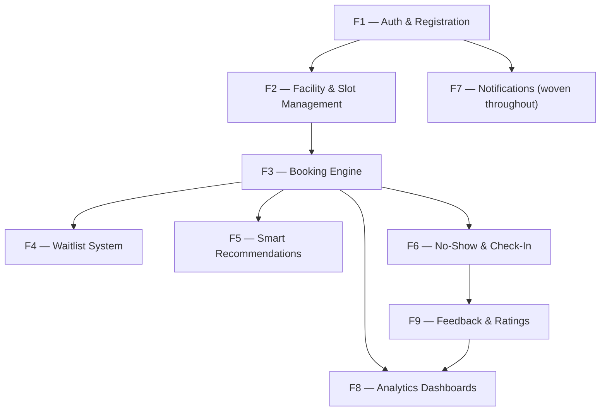
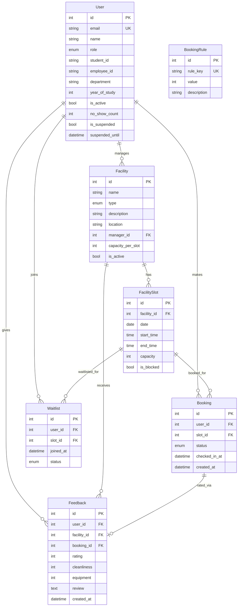

# UniReserve — Full PRD Analysis & Implementation Plan

## 1. Product Summary

**UniReserve** is a university facility reservation system enabling students to book study rooms, library seats, computer labs, and other campus facilities. It features three user roles (Student, Facility Manager, Super Admin), a robust booking engine with double-booking prevention, FIFO waitlists, smart recommendations, no-show enforcement, and analytics dashboards.

**Tech Stack (per PRD):** React (Vite) · Django REST Framework · MySQL · JWT Auth · Chart.js · react-hot-toast

---

## 2. Feature Inventory & Dependency Map



| # | Feature | Depends On | Priority | Complexity |
|---|---------|-----------|----------|------------|
| F1 | Auth & Registration | — | 🔴 Critical | Medium |
| F2 | Facility & Slot Management | F1 | 🔴 Critical | Medium |
| F3 | Booking Engine | F1, F2 | 🔴 Critical | High |
| F4 | Waitlist System | F3 | 🟡 High | Medium |
| F5 | Smart Recommendations | F3 | 🟢 Medium | Low |
| F6 | No-Show & Check-In | F3 | 🟡 High | Medium |
| F7 | Notifications | F1 (woven through all) | 🟡 High | Low |
| F8 | Analytics Dashboards | F3, F9 | 🟢 Medium | Medium |
| F9 | Feedback & Ratings | F6 | 🟢 Medium | Low |

---

## 3. Build Order (Confirmed by Feature Guide)

| Phase | Feature | Rationale |
|-------|---------|-----------|
| 1 | **F1 — Auth & Registration** | Foundation — everything depends on users, roles, and JWT |
| 2 | **F2 — Facilities & Slots** | Bookings need facilities to exist first |
| 3 | **F3 — Booking Engine** | Core value proposition of the product |
| 4 | **F4 — Waitlist** | Natural extension of booking when slots are full |
| 5 | **F5 — Recommendations** | Needs booking history data to analyze |
| 6 | **F6 — No-Show & Check-In** | Needs active bookings with time-slot awareness |
| 7 | **F7 — Notifications** | Woven throughout F1–F6, but formalized and consolidated here |
| 8 | **F9 — Feedback & Ratings** | Needs check-in data from F6 |
| 9 | **F8 — Analytics** | Built last — aggregates all data from every other feature |

---

## 4. Detailed Feature Breakdown

### F1 — Authentication & Registration

**What it does:** Lets students self-register with email verification, managers register pending admin approval, and all users log in with JWT-based auth with role-based routing.

**Database Models:**
- `CustomUser` (extends `AbstractBaseUser`): `email`, `name`, `role` (student/manager/admin), `student_id`, `employee_id`, `department`, `year_of_study`, `facility_responsible_for`, `is_active`, `is_staff`, `no_show_count`, `is_suspended`, `date_joined`

**Backend APIs:**
| Method | Endpoint | Access | Description |
|--------|----------|--------|-------------|
| POST | `/api/auth/register/student/` | Public | Student registration → inactive account + email verification |
| POST | `/api/auth/register/manager/` | Public | Manager registration → pending approval |
| GET | `/api/auth/verify/<token>/` | Public | Email verification → activate account |
| POST | `/api/auth/login/` | Public | JWT login → access + refresh tokens + role |
| POST | `/api/auth/password-reset/` | Public | Send password reset link |
| POST | `/api/auth/password-reset/confirm/` | Public | Set new password |

**Frontend Pages:**
- Login Page (role-based redirect)
- Student Registration Page
- Manager Registration Page
- Email Verification Page
- Forgot/Reset Password Pages
- `ProtectedRoute` HOC for role-based guarding

**Completion Criteria:** Student can register → verify email → log in → get redirected by role → log out.

---

### F2 — Facility & Slot Management

**What it does:** Managers define bookable facilities and their time slots. Students browse and see real-time availability (green/yellow/red indicators).

**Database Models:**
- `Facility`: `name`, `type` (library/study_room/computer_lab/discussion_room/seminar_hall/music_room/printing_lab), `description`, `location`, `manager_id` (FK), `capacity_per_slot`, `is_active`
- `FacilitySlot`: `facility_id` (FK), `date`, `start_time`, `end_time`, `capacity`, `is_blocked` + computed `current_bookings` & `availability_status`

**Backend APIs:**
| Method | Endpoint | Access | Description |
|--------|----------|--------|-------------|
| GET | `/api/facilities/` | Public | Browse all active facilities (with type filter) |
| GET | `/api/facilities/<id>/` | Public | Facility detail + upcoming slots |
| POST | `/api/facilities/` | Manager/Admin | Create facility |
| GET | `/api/facilities/<id>/slots/?date=` | Public | Slots for a facility on a date |
| POST | `/api/facilities/<id>/slots/` | Manager | Create time slots |
| PATCH | `/api/slots/<id>/block/` | Manager | Block a slot |

**Frontend Pages:**
- Facility Browser (student) — grid of cards with type filter
- Slot Picker — date picker + color-coded time grid
- Manager Facility Management — CRUD for their facilities & slots

**Completion Criteria:** Manager can create facilities + slots; student can browse and see availability colors.

---

### F3 — Booking Engine

**What it does:** Students book slots with rule validation (daily/weekly limits, group minimums). Computer labs require manager approval. Double-booking prevented at DB level.

**Database Models:**
- `Booking`: `user_id`, `slot_id`, `status` (active/cancelled/no_show/pending_approval), `checked_in_at`, `created_at` + unique constraint on (user, slot) for active bookings
- `BookingRule`: `rule_key`, `value`, `description` — seeded with defaults

**Backend APIs:**
| Method | Endpoint | Access | Description |
|--------|----------|--------|-------------|
| POST | `/api/bookings/` | Student | Create booking (runs all validation checks) |
| GET | `/api/bookings/my/` | Student | My booking history |
| GET | `/api/bookings/<id>/` | Student | Booking detail |
| PATCH | `/api/bookings/<id>/cancel/` | Student | Cancel (30-min window check) |
| GET | `/api/bookings/pending/` | Manager | Pending lab approval requests |
| PATCH | `/api/bookings/<id>/approve/` | Manager | Approve booking |
| PATCH | `/api/bookings/<id>/reject/` | Manager | Reject with note |
| GET | `/api/rules/` | Admin | List booking rules |
| PATCH | `/api/rules/<id>/` | Admin | Update rule value |

**Service Layer (`bookings/services.py`):**
- `check_duplicate()`, `check_daily_limit()`, `check_weekly_hours()`, `check_slot_capacity()`, `create_booking()`

**Frontend Pages:**
- Booking confirmation modal (after slot selection)
- My Bookings (Upcoming + Past tabs with status badges)
- Manager Pending Approvals (table with Approve/Reject)
- Admin Rules Configuration (inline-edit table)

**Completion Criteria:** Student can book, view My Bookings, cancel; manager can approve/reject lab requests.

---

### F4 — Waitlist System

**What it does:** When a slot is full, students join a FIFO queue. When a cancellation occurs, the first waitlisted student is auto-promoted.

**Database Models:**
- `Waitlist`: `user_id`, `slot_id`, `joined_at`, `status` (waiting/promoted/left) + unique constraint on (user, slot)

**Backend APIs:**
| Method | Endpoint | Access | Description |
|--------|----------|--------|-------------|
| POST | `/api/waitlist/` | Student | Join waitlist for a full slot |
| DELETE | `/api/waitlist/<id>/` | Student | Leave waitlist |
| GET | `/api/waitlist/my/` | Student | My waitlist positions |

**Auto-promotion:** `promote_from_waitlist(slot)` called inside `BookingCancelView`.

**Completion Criteria:** Student sees "Join Waitlist" on full slots; auto-promotion works on cancellation.

---

### F5 — Smart Recommendations

**What it does:** On student login, analyzes their last 30 days of bookings to recommend low-traffic slots for their preferred facility types.

**No new models.** Computed from existing `Booking` + `FacilitySlot` data.

**Backend:** `GET /api/recommendations/` — returns top 3 least-crowded slots per recommended facility type.

**Frontend:** Horizontal scroll of recommendation cards on student dashboard.

**Completion Criteria:** Dashboard shows 3+ relevant low-traffic suggestions on login.

---

### F6 — No-Show & Check-In

**What it does:** Students check in within 15 minutes of slot start. A management command flags no-shows and suspends repeat offenders (3 strikes → 7-day ban).

**No new models.** Uses `Booking.checked_in_at` and `User.no_show_count`/`is_suspended` from F1/F3.

**Backend:**
- `POST /api/bookings/<id>/check-in/` — validates check-in window
- `python manage.py detect_no_shows` — management command (idempotent)
- `PATCH /api/admin/users/<id>/clear-warnings/` — admin clears warnings

**Completion Criteria:** Check-in button works in window; command flags no-shows correctly.

---

### F7 — Notifications (Consolidation)

**What it does:** Formal notification layer — email helpers for every event, consistent toast patterns on frontend.

**Backend:** `notifications/email.py` with: `send_booking_confirmation()`, `send_cancellation()`, `send_waitlist_promotion()`, `send_no_show_warning()`, `send_suspension_notice()`

**Frontend:** `src/utils/notify.js` with `notifySuccess()`, `notifyError()`, `notifyInfo()`.

**Completion Criteria:** Email prints to console for every action; toast on every API response.

---

### F8 — Analytics Dashboards

**What it does:** Visual dashboards for managers (their facilities) and admins (system-wide).

**No new models.** Aggregates from `Booking`, `FacilitySlot`, `Feedback`, `User`.

**Backend:**
- `GET /api/analytics/manager/` — daily bookings, peak hours, top facilities, cancellation rate, avg rating
- `GET /api/analytics/admin/` — booking trends, facility popularity, no-show rate, suspensions

**Frontend:** Chart.js bar/line charts, CSS heatmap, stat cards, manager approval queue.

**Completion Criteria:** Manager sees bar chart + heatmap; admin sees trend line + facility ranking.

---

### F9 — Feedback & Ratings

**What it does:** After a checked-in booking ends, students rate the facility (1–5 stars for Overall, Cleanliness, Equipment) with optional text review.

**Database Models:**
- `Feedback`: `user_id`, `facility_id`, `booking_id` (unique), `rating`, `cleanliness`, `equipment`, `review`, `created_at`

**Backend:**
- `POST /api/feedback/` — requires checked-in booking
- `GET /api/feedback/facility/<id>/` — all feedback for a facility
- `GET /api/feedback/facility/<id>/summary/` — aggregated averages

**Completion Criteria:** Past bookings show "Rate" button if checked in; ratings appear in manager dashboard.

---

## 5. Identified Ambiguities & Missing Details

> [!IMPORTANT]
> The following items need clarification before or during implementation:

| # | Ambiguity | Impact | Suggested Resolution |
|---|-----------|--------|---------------------|
| 1 | **Group booking flow** — PRD says study rooms require "minimum 2 participants listed" but doesn't specify how participants are added (email list? user search?) | F3 | Add a `participants` JSON field on Booking; require entering participant emails at booking time |
| 2 | **Slot auto-generation vs manual** — Are slots created manually by managers each day, or auto-generated from operating-hour templates? | F2 | Start with manual creation; optionally add a "generate weekly slots" bulk action later |
| 3 | **No-show detection trigger** — PRD says "management command runs or can be triggered manually" — should it run on a cron schedule? | F6 | For MVP, manual trigger via admin panel button + document cron setup for production |
| 4 | **Suspension duration** — PRD says "7 days" but no field tracks when suspension started | F6 | Add `suspended_until` DateTimeField to User; auto-unsuspend check on login |
| 5 | **Email verification token expiry** — No TTL specified | F1 | Default to 24-hour expiry via Django signing `max_age` |
| 6 | **Polling vs real-time** — PRD says "poll every 30 seconds" for availability — this could be expensive at scale | F2 | Acceptable for university-scale; document WebSocket upgrade path |
| 7 | **Manager-to-facility assignment** — Is it 1:1 or 1:many? Field name "facility_responsible_for" suggests 1:1 | F2 | Use FK on Facility (many facilities → one manager) allowing 1:many |
| 8 | **Check-in mechanism** — PRD says "button on active booking card" — no QR code or location verification | F6 | Simple button click for MVP; flag as potential honor-system concern |

---

## 6. Proposed Folder Structure

```
UniReserve/
├── unireserve-backend/          # Django project
│   ├── unireserve/              # Project settings
│   │   ├── settings.py
│   │   ├── urls.py
│   │   └── wsgi.py
│   ├── accounts/                # F1 - Auth & Users
│   │   ├── models.py
│   │   ├── serializers.py
│   │   ├── views.py
│   │   ├── urls.py
│   │   └── permissions.py
│   ├── facilities/              # F2 - Facility & Slots
│   │   ├── models.py
│   │   ├── serializers.py
│   │   ├── views.py
│   │   └── urls.py
│   ├── bookings/                # F3 - Booking Engine
│   │   ├── models.py
│   │   ├── serializers.py
│   │   ├── services.py          # Business logic layer
│   │   ├── views.py
│   │   └── urls.py
│   ├── waitlist/                # F4 - Waitlist
│   │   ├── models.py
│   │   ├── views.py
│   │   └── urls.py
│   ├── recommendations/         # F5 - Smart Recommendations
│   │   ├── views.py
│   │   └── urls.py
│   ├── notifications/           # F7 - Email helpers
│   │   └── email.py
│   ├── analytics/               # F8 - Analytics
│   │   ├── views.py
│   │   └── urls.py
│   ├── feedback/                # F9 - Feedback & Ratings
│   │   ├── models.py
│   │   ├── serializers.py
│   │   ├── views.py
│   │   └── urls.py
│   ├── manage.py
│   └── requirements.txt
│
├── unireserve-frontend/         # React (Vite) project
│   ├── src/
│   │   ├── api/
│   │   │   └── axios.js         # Axios instance + interceptors
│   │   ├── context/
│   │   │   └── AuthContext.jsx
│   │   ├── components/
│   │   │   ├── ProtectedRoute.jsx
│   │   │   ├── Navbar.jsx
│   │   │   ├── Toast.jsx
│   │   │   └── ...
│   │   ├── pages/
│   │   │   ├── LoginPage.jsx
│   │   │   ├── StudentRegisterPage.jsx
│   │   │   ├── ManagerRegisterPage.jsx
│   │   │   ├── StudentDashboard.jsx
│   │   │   ├── FacilityBrowser.jsx
│   │   │   ├── SlotPicker.jsx
│   │   │   ├── MyBookings.jsx
│   │   │   ├── ManagerDashboard.jsx
│   │   │   ├── AdminDashboard.jsx
│   │   │   └── ...
│   │   ├── utils/
│   │   │   └── notify.js
│   │   ├── App.jsx
│   │   └── main.jsx
│   ├── index.html
│   ├── package.json
│   └── vite.config.js
│
├── UniReserve_PRD.docx
└── UniReserve_Feature_Build_Guide.docx
```

---

## 7. Database Schema Overview



---

## 8. Verification Plan

### Per-Feature Verification
Each feature will be verified via:
1. **Django unit tests** — model validations, service logic, API endpoint responses
2. **Manual API testing** — curl/Postman against running Django dev server
3. **Frontend smoke test** — browser walkthrough of the feature's UI flow
4. **Integration test** — full end-to-end scenario (e.g., register → verify → login → book → cancel → waitlist promote)

### Final System Verification
- Run full Django test suite: `python manage.py test`
- Run frontend build: `npm run build` (verify no build errors)
- End-to-end walkthrough of all 3 role flows in the browser

---

## User Review Required

> [!IMPORTANT]
> **Please confirm the following before I begin Feature 1 (Auth & Registration):**
>
> 1. **Build order** — Do you agree with the phased approach (F1 → F2 → F3 → ... → F8)?
> 2. **Ambiguities** — Review the 8 ambiguities in Section 5. Do my suggested resolutions work for you, or do you have different preferences?
> 3. **Tech stack** — React + Vite + Django REST + MySQL + JWT as specified. Any changes?
> 4. **Project location** — I'll create the project in `/Users/shrey/Desktop/Shrey/Pyhton/Python PBL MVP/`. Confirm?
> 5. **MySQL credentials** — What are your MySQL host, port, username, password, and database name?
> 6. **Email setup** — Should I use console email backend for development (emails printed to terminal)?

